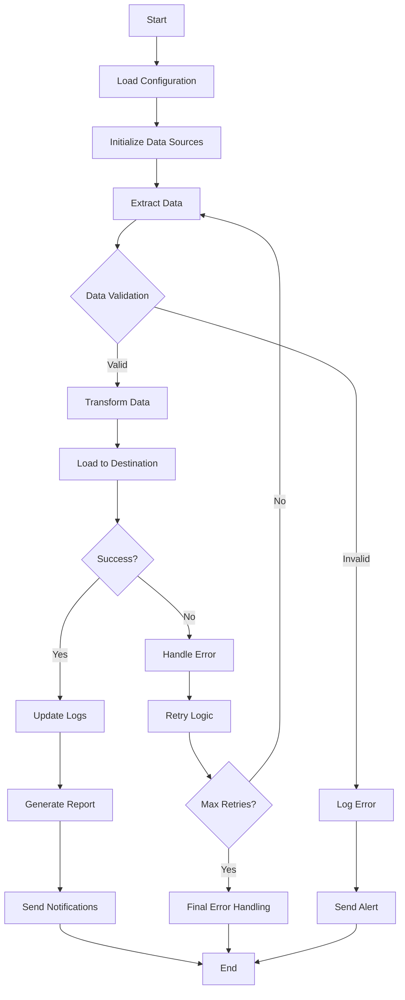

# AWS-Process-and-Materialize-View

A comprehensive data automation solution for streamlining data processing workflows.

## Overview

This project automates data collection, processing, transformation, and storage tasks to improve efficiency and reduce manual intervention in data workflows.

## Features

- Automated data ingestion from multiple sources
- Data validation and cleaning
- Data transformation and enrichment
- Error handling and logging
- Scheduled execution support

## Testing

```bash
python src/tester.py
```

## Deployment

replace {placeholder} with your AWS account number to deploy the lambda function

```bash
docker build -t lamb .
docker tag lamb:latest {placeholder}
docker push {placeholder}

```

## Process Flow



## Project Structure

```
Data_Automation/
├── src/
│   ├── Connections/
│   ├── Controller (for type safety)/
│   ├── Repositories/
│   ├── Services (for business logic)/
│   ├── SQL (for SQL queries)/
│   └── Utils (for utility functions)/
├── tester (for testing)
├── requirements.txt
└── main.py
```

## Requirements

- numpy>=1.22.4,<2.0.0
- pyarrow==17.0.0
- s3fs==2024.9.0